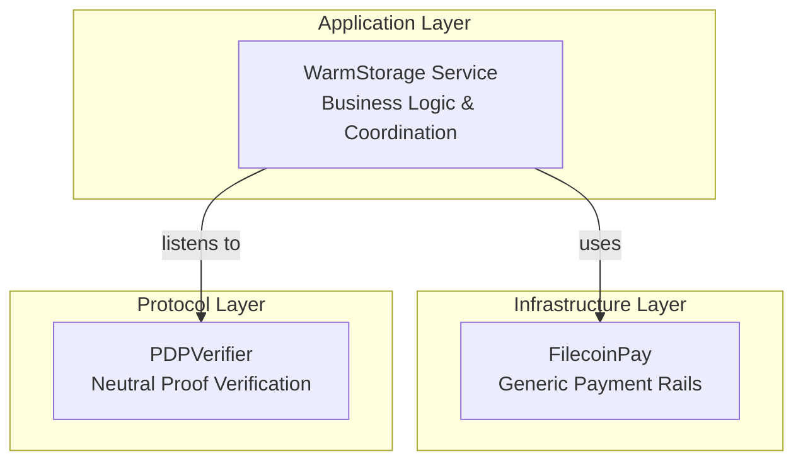
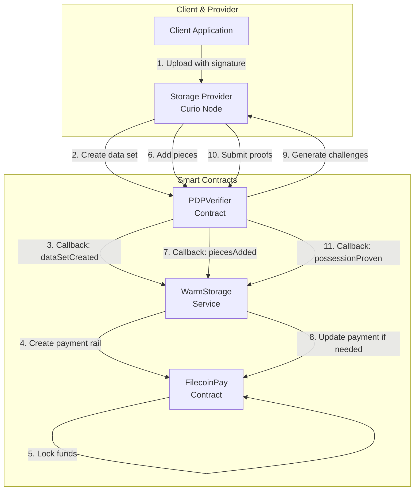
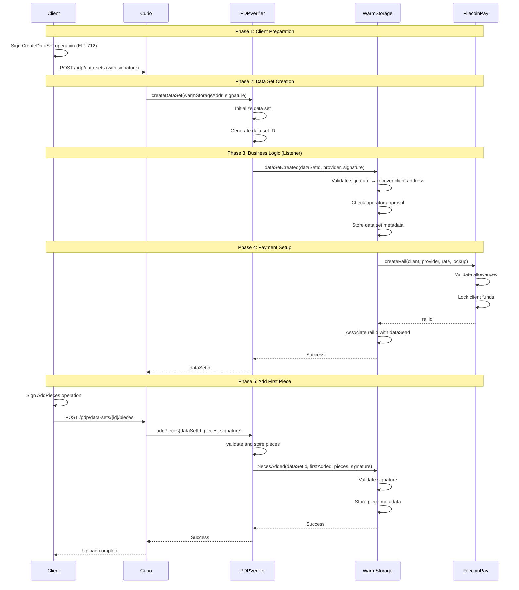
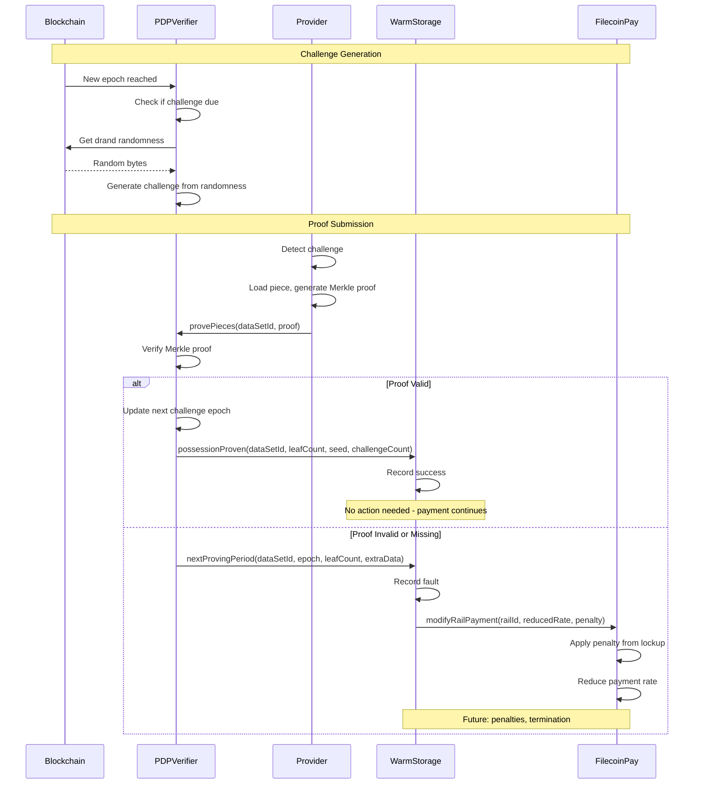
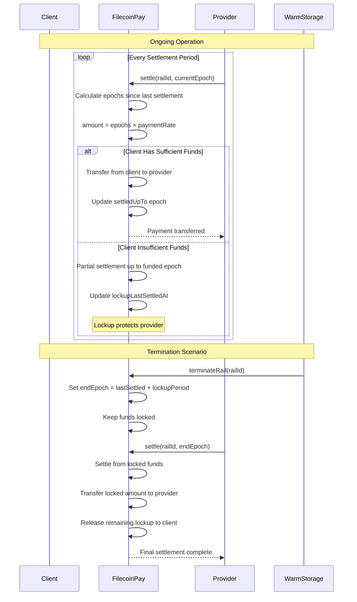

This page explains the layered architecture of Filecoin On-Chain Cloud and how all components work together. For component-specific technical details, see:

- [**PDP Overview**](/core-concepts/pdp-overview) - Cryptographic protocol details
- [**FilecoinPay Technical Overview**](/core-concepts/filecoin-pay-overview) - Payment system details
- [**Warm Storage Overview**](/core-concepts/fwss-overview) - Business logic layer details

## Architectural Principles

The Filecoin On-Chain Cloud architecture follows a **layered design** that separates concerns across three distinct layers:



### Why This Design?

**Separation of Concerns**:

- **Protocol Layer (PDPVerifier)**: Provides neutral, generic proof verification without business logic
- **Infrastructure Layer (FilecoinPay)**: Offers reusable payment infrastructure for any service
- **Application Layer (WarmStorage)**: Implements storage-specific business logic and coordination

**Composability**:

- Each layer can be used independently
- New services can build on PDPVerifier and FilecoinPay without modifying them
- Protocol upgrades don't break application logic

**Extensibility**:

- Listener pattern enables custom business logic
- Validator pattern allows custom payment mediation
- Operator pattern supports service-specific management

## System Architecture

The Filecoin On-Chain Cloud system consists of three smart contracts working together on Filecoin EVM:



## Component Details

:::note[Component Overviews]
The following sections provide architectural overviews of each component and how they interact. For detailed technical references and API documentation, see the dedicated pages:

- [**PDP Overview**](/core-concepts/pdp-overview) - Complete PDPVerifier contract reference
- [**FilecoinPay Technical Overview**](/core-concepts/filecoin-pay-overview) - Complete FilecoinPay contract reference
- [**Warm Storage Overview**](/core-concepts/fwss-overview) - Complete WarmStorage contract reference
  :::

### PDPVerifier Contract (Protocol Layer)

**Purpose**: Core proof verification protocol (neutral layer)

**Source**: `filecoin-services/service_contracts/lib/pdp/src/PDPVerifier.sol`

**Key Characteristics**:

- **Neutral**: No business logic or payment handling
- **Generic**: Can be used by any storage service
- **Singleton**: One contract manages all data sets
- **Event-driven**: Uses listener pattern for extensibility

**Responsibilities**:

- Manage data sets on-chain
- Generate randomized challenges (using drand)
- Verify Merkle proofs from providers
- Call listener contracts on events
- No business logic or payments

**Key Functions**:

```solidity
contract PDPVerifier {
    // Data set management
    function createDataSet(
        address listenerAddr,
        bytes calldata extraData
    ) external returns (uint256 dataSetId);

    // Piece management
    function addPieces(
        uint256 dataSetId,
        Cids.Cid[] calldata pieceCids,
        uint256[] calldata sizes,
        bytes calldata extraData
    ) external;

    function removePieces(
        uint256 dataSetId,
        Cids.Cid[] calldata pieceCids
    ) external;

    // Proof verification
    function provePieces(
        uint256 dataSetId,
        uint256[] calldata leafIndices,
        Proof.Inclusion calldata proof
    ) external;
}
```

**Challenge Generation**:

- Uses Filecoin's drand beacon for randomness
- Unpredictable (providers can't pre-compute)
- Deterministic verification

**Listener Pattern**:

```solidity
interface PDPListener {
    function dataSetCreated(uint256 dataSetId, address creator, bytes calldata extraData);
    function piecesAdded(uint256 dataSetId, uint256 firstAdded, Cids.Cid[] memory pieceData, bytes calldata extraData);
    function possessionProven(uint256 dataSetId, uint256 challengedLeafCount, uint256 seed, uint256 challengeCount);
    function nextProvingPeriod(uint256 dataSetId, uint256 challengeEpoch, uint256 leafCount, bytes calldata extraData);
}
```

The listener pattern allows storage services to inject custom business logic at key lifecycle events without modifying the core protocol. The PDPVerifier calls these methods on the service contract (record keeper) when key events occur.

[Learn more about PDP →](/core-concepts/pdp-overview)

### FilecoinPay Contract (Infrastructure Layer)

**Purpose**: Generic payment infrastructure

**Contract Name**: FilecoinPay V1

**Source**: `filecoin-services/service_contracts/lib/fws-payments/src/FilecoinPayV1.sol`

**Key Characteristics**:

- **Generic**: Not specific to storage services
- **Reusable**: Any service can create payment rails
- **Guaranteed**: Lockup mechanism protects providers
- **Flexible**: Supports streaming and one-time payments

**Features**:

- Native & ERC-20 token deposits
- Payment rails (payment channels)
- Lockup mechanism (safety hatch)
- Operator approvals
- Settlement

**Key Concepts**:

**Payment Rail**:

```solidity
struct Rail {
    address payer;           // Client
    address payee;           // Provider
    address operator;        // Service contract
    uint256 paymentRate;     // Tokens per epoch
    uint256 lockupPeriod;    // Epochs
    uint256 lockupFixed;     // One-time pool
    uint256 settledUpTo;     // Last settled epoch
    uint256 endEpoch;        // 0 if active
}
```

**Core Functions**:

```solidity
contract FilecoinPay {
    // Deposits
    function deposit(uint256 amount) external;

    // Operator management
    function approveServiceOperator(
        address operator,
        uint256 rateAllowance,
        uint256 lockupAllowance,
        uint256 maxLockupPeriod
    ) external;

    // Rails
    function createRail(
        address payer,
        address payee,
        uint256 paymentRate,
        uint256 lockupPeriod,
        uint256 lockupFixed
    ) external returns (uint256 railId);

    function terminateRail(uint256 railId) external;

    function modifyRailPayment(
        uint256 railId,
        uint256 newPaymentRate,
        uint256 oneTimePayment
    ) external;

    function modifyRailLockup(
        uint256 railId,
        uint256 newLockupPeriod,
        uint256 newLockupFixed
    ) external;

    // Settlement
    function settle(uint256 railId, uint256 targetEpoch) external;

    // Queries
    function accountInfo(address account)
        external view returns (AccountInfo memory);
}
```

**Lockup Safety Hatch**:

- During active rail: Minimum balance requirement
- After termination: Guaranteed settlement window
- Protects providers from client abandonment

[Learn more about FilecoinPay →](/core-concepts/filecoin-pay-overview)

### WarmStorageService Contract (Application Layer)

**Purpose**: Business logic for storage marketplace

**Source**: `filecoin-services/service_contracts/src/FilecoinWarmStorageService.sol`

**Key Characteristics**:

- **Storage-specific**: Implements business logic for decentralized storage
- **Orchestrator**: Coordinates between PDP verification and payments
- **Authenticated**: Validates all client operations via EIP-712 signatures
- **Pluggable Service**: One implementation of the PDPListener interface

**Split Architecture**:

- Main contract: Write operations and listener callbacks
- View contract: Read-only queries (size optimization)

**Responsibilities**:

- Client authentication (EIP-712 signatures)
- Payment rail creation and management
- PDP integration via listener callbacks
- Pricing and cost calculation
- Metadata management (data sets and pieces)

**Key Functions**:

```solidity
contract FilecoinWarmStorageService is SimplePDPService {
    // Pricing
    function getServicePrice()
        external view returns (
            uint256 pricePerEpochPerByte,
            uint256 cdnPricePerEpochPerByte
        );

    // PDPListener callbacks
    function dataSetCreated(
        uint256 dataSetId,
        address creator,
        bytes calldata extraData  // Contains client signature
    ) external override {
        // 1. Verify client signature
        // 2. Create payment rail
        // 3. Store data set metadata
    }

    function piecesAdded(
        uint256 dataSetId,
        uint256 firstAdded,
        Cids.Cid[] memory pieceData,
        bytes calldata extraData  // Contains client signature
    ) external override {
        // 1. Verify client signature
        // 2. Store piece metadata
        // 3. Update payment rail if needed
    }

    function possessionProven(
        uint256 dataSetId,
        uint256 challengedLeafCount,
        uint256 seed,
        uint256 challengeCount
    ) external override {
        // Handle successful proofs
        // Track provider performance
    }

    function nextProvingPeriod(
        uint256 dataSetId,
        uint256 challengeEpoch,
        uint256 leafCount,
        bytes calldata extraData
    ) external override {
        // Handle proof failures/faults
        // Apply penalties if needed (future)
    }
}
```

**Authentication Flow**:

1. Client signs operation with EIP-712
2. Send request to Curio with signature
3. Curio calls PDPVerifier with signature as `extraData`
4. PDPVerifier calls WarmStorage callback with `extraData`
5. WarmStorage recovers signer and validates
6. If valid, executes business logic

**EIP-712 Validation**:

```solidity
function _validateSignature(
    bytes calldata signature,
    bytes32 structHash
) internal view returns (address signer) {
    bytes32 digest = _hashTypedDataV4(structHash);
    signer = ECDSA.recover(digest, signature);
}
```

[Learn more about WarmStorage →](/core-concepts/fwss-overview)

## Data Flow Examples

### Creating a Data Set with First Piece

This example shows how all three contracts work together when a client uploads their first file:



### Proof Verification Cycle

This shows the ongoing verification process and how failures trigger business logic:



### Payment Settlement Flow

This shows how payments flow from client to provider:



## Integration Patterns

### How Storage Services Use the Architecture

The layered architecture enables storage services to focus on business logic:

**Storage Service Responsibilities**:

1. **Define pricing model** - Set rates per byte, CDN pricing, etc.
2. **Implement authentication** - Validate client signatures
3. **Handle callbacks** - Respond to PDP events (creation, proofs, faults)
4. **Coordinate payments** - Create rails, handle penalties
5. **Manage metadata** - Store and retrieve data set and piece metadata

**What Services DON'T Do** (handled by lower layers):

- ❌ Proof verification (PDPVerifier handles it)
- ❌ Payment infrastructure (FilecoinPay handles it)
- ❌ Challenge generation (PDPVerifier handles it)
- ❌ Lockup management (FilecoinPay handles it)

### Building Custom Services

You can build your own storage service on top of PDPVerifier and FilecoinPay:

```solidity
contract MyCustomStorageService is SimplePDPService {
    IFilecoinPay public payments;

    // Implement custom pricing
    function calculatePrice(uint256 size, bool premium)
        public pure returns (uint256) {
        // Your custom pricing logic
    }

    // PDPListener callbacks
    function dataSetCreated(
        uint256 dataSetId,
        address creator,
        bytes calldata extraData
    ) external override {
        // 1. Your custom authentication
        // 2. Your custom metadata handling
        // 3. Create payment rail with your pricing
        uint256 rate = calculatePrice(size, isPremium);
        payments.createRail(payer, payee, rate, lockup, 0);
    }

    function possessionProven(
        uint256 dataSetId,
        uint256 challengedLeafCount,
        uint256 seed,
        uint256 challengeCount
    ) external override {
        // Record successful proof
        // Update provider performance metrics
    }

    function nextProvingPeriod(
        uint256 dataSetId,
        uint256 challengeEpoch,
        uint256 leafCount,
        bytes calldata extraData
    ) external override {
        // Your custom SLA enforcement for failures
        // Apply your penalty model
    }
}
```

## Summary

**Filecoin On-Chain Cloud Architecture**:

- **Layered design** separates protocol, infrastructure, and application concerns
- **Three core contracts** work together through well-defined interfaces
- **Protocol layer (PDPVerifier)** provides neutral proof verification
- **Infrastructure layer (FilecoinPay)** offers generic payment rails
- **Application layer (WarmStorage)** implements storage business logic

**Key Patterns**:

- **Listener pattern**: PDPVerifier → Storage Services
- **Operator pattern**: Storage Services → FilecoinPay
- **Validator pattern**: Custom mediation of payments
- **Callback architecture**: Event-driven coordination

**Benefits**:

- ✅ **Separation of concerns**: Each layer has clear responsibilities
- ✅ **Composability**: Components can be reused for different services
- ✅ **Extensibility**: New services without modifying core protocols
- ✅ **Flexibility**: Custom business logic and pricing models

## Next Steps

Now that you understand the architecture:

- [**PDP Overview**](/core-concepts/pdp-overview) - Deep dive into proof verification
- [**Filecoin Pay**](/core-concepts/filecoin-pay-overview) - Payment rails and lockup mechanism
- [**Warm Storage**](/core-concepts/fwss-overview) - Storage service implementation
- [**Developer Guides**](/synapse-sdk/) - Build with the SDK
