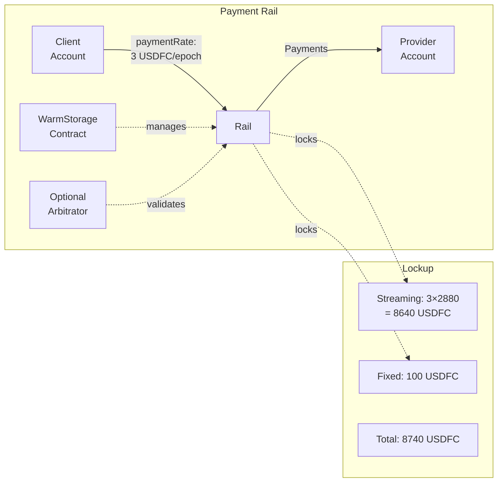
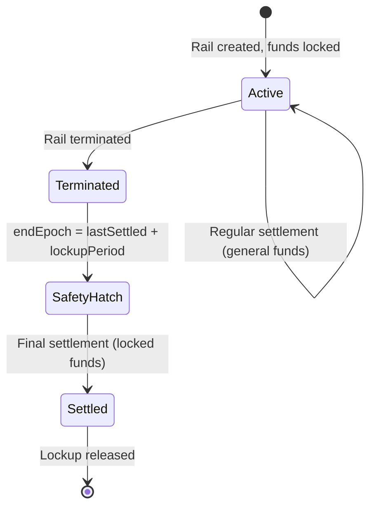
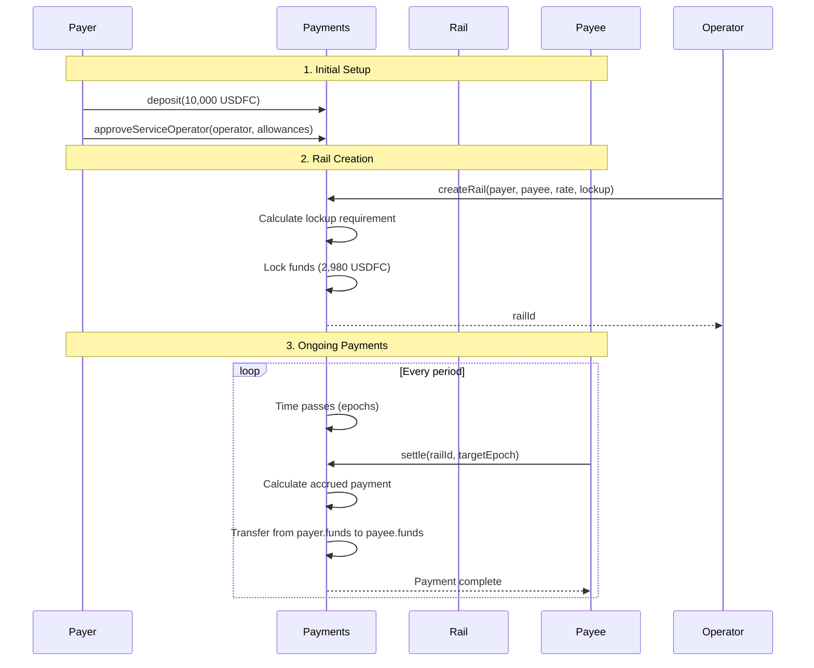
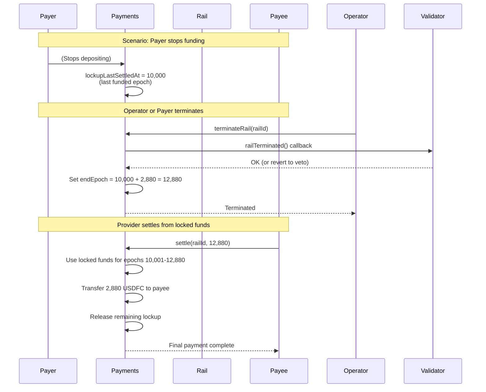

This guide explains **FilecoinPay V1**, the generic payment infrastructure that powers automated payment channels (rails) between clients and storage providers in the Filecoin On-Chain Cloud.

:::tip[Related Documentation]

- **Conceptual understanding**: See [**FilecoinPay Cookbook**](/core-concepts/filecoin-pay-cookbook) for use cases and design patterns
- **System integration**: See [**System Architecture**](/core-concepts/architecture) for how FilecoinPay integrates with storage and PDP verification
  :::

## What is FilecoinPay?

**FilecoinPay V1** is a smart contract system for **automated ERC-20 token payments** through configurable payment channels called "rails."

Think of it like setting up automatic bill pay, but:

- ✅ **On-chain**: All payments verified by smart contracts
- ✅ **Guaranteed**: Lockup mechanism ensures providers get paid
- ✅ **Flexible**: Supports both streaming and one-time payments
- ✅ **Generic**: Not specific to storage (any service can use it)

## Core Concepts

### Account

**What**: Token balance and lockup tracking for a user

```solidity
struct Account {
    uint256 funds;              // Total USDFC deposited
    uint256 lockupCurrent;      // Currently locked (sum of all rails)
    uint256 lockupLastSettledAt; // Last epoch with full funding
}
```

**Key Properties**:

- One account per address per token
- Holds deposited tokens
- Tracks locked vs available funds
- Same address can be payer and payee

**Available Funds**: `funds - lockupCurrent`

- Can be withdrawn anytime
- Not locked in active rails

### Payment Rail

**What**: An automated payment channel from payer to payee

```solidity
struct Rail {
    address payer;           // Client
    address payee;           // Provider
    address operator;        // Service contract (e.g., WarmStorage)
    address validator;       // Optional arbitrator
    uint256 paymentRate;     // Tokens per epoch
    uint256 lockupPeriod;    // Guarantee period (epochs)
    uint256 lockupFixed;     // One-time payment pool
    uint256 settledUpTo;     // Last settled epoch
    uint256 endEpoch;        // Termination epoch (0 if active)
}
```

**Visual Representation**:



**Properties**:

- **One-to-one**: Specific payer to specific payee
- **Managed**: Operator creates and modifies
- **Validated**: Optional validator can mediate
- **Guaranteed**: Lockup ensures payment

### Operator

**What**: Trusted smart contract that manages rails on behalf of payers

**Examples**: WarmStorage contract (storage services), future compute or CDN contracts

**Capabilities**: Create rails, modify rail terms (rate, lockup), settle payments, terminate rails, execute one-time payments

**Constraints**:

- Must be explicitly approved by payer
- Subject to allowance limits set by payer:

```solidity
struct ServiceApproval {
    uint256 rateAllowance;      // Max tokens/epoch across all rails
    uint256 lockupAllowance;    // Max total lockup
    uint256 maxLockupPeriod;    // Max lockup period per rail
}
```

For SDK implementation of operator approvals, see the [Payment Setup Guide](/synapse-sdk/payments/).

### Validator

**What**: Optional arbitrator that mediates payments and terminations

**Capabilities**:

- **Validate settlements**: Adjust payment amounts during settlement
- **Veto terminations**: Block rail termination attempts
- **Decide final payout**: Determine total payout after termination

**Use Cases**:

- Reduce payment if service quality poor
- Prevent termination if contract terms not met
- Apply penalties for faults

**In Warm Storage**:

- Currently not used (validator = address(0))
- Future: Could implement SLA enforcement

## Lockup Mechanism

The lockup mechanism ensures providers get paid even if clients abandon their accounts. It's a **safety guarantee**, not a pre-payment.

### Two Types of Lockup

**Streaming Lockup** = `paymentRate × lockupPeriod`

- Guarantees provider payment for the lockup period
- Example: 1 USDFC/epoch × 2,880 epochs (1 day) = 2,880 USDFC locked
- During normal operation: Acts as minimum balance, payments from general funds
- After termination: Safety hatch activates, provider can settle from locked funds

**Fixed Lockup**

- Reserved pool for one-time payments
- Drawn directly when immediate payments needed
- Reduced as payments are made

### How It Works



**Normal Operation**: Payments flow from general account funds, lockup remains untouched

**Safety Hatch** (after termination): Provider can settle up to `endEpoch` using locked funds, even if client account is empty

**Example**:

```
Rail: 1 USDFC/epoch, 2,880 epoch lockup period
Terminated at epoch 10,000
Provider can settle through epoch 12,880 using the 2,880 USDFC lockup
This guarantees payment even if client disappears
```

## Payment Flows

### Normal Operation (Active Rail)



### Termination and Safety Hatch



## Key Operations

The FilecoinPay contract provides these core operations:

### Rail Management

**Create Rail** - Operator establishes payment channel:

```solidity
function createRail(address payer, address payee, uint256 paymentRate,
    uint256 lockupPeriod, uint256 lockupFixed, address validator)
    returns (uint256 railId)
```

**Modify Rail** - Operator adjusts payment terms:

```solidity
function modifyRailPayment(uint256 railId, uint256 newPaymentRate, uint256 oneTimePayment);
function modifyRailLockup(uint256 railId, uint256 newLockupPeriod, uint256 newLockupFixed);
```

**Terminate Rail** - Payer or operator ends payment channel:

```solidity
function terminateRail(uint256 railId)
```

### Settlement

**Settle Rail** - Anyone can trigger payment settlement:

```solidity
function settleRail(uint256 railId, uint256 targetEpoch)
```

- Active rails: Settle from general funds up to payer's funded epochs
- Terminated rails: Settle from locked funds up to `endEpoch` (safety hatch)
- Optional validator can adjust payment amounts

For SDK implementation and examples, see the [Payment Guides](/synapse-sdk/payments/).

## Security Properties

**Safety Guarantees**:

- **Lockup protection**: Providers guaranteed payment for lockup period even after termination
- **Allowance limits**: Payers control operator spending through rate, lockup, and period caps
- **Validator mediation**: Optional third-party arbitration for disputes
- **No double-spend**: On-chain accounting prevents payment manipulation

**Trust Model**:

- Payers trust approved operators to create fair rails
- Providers trust lockup mechanism for payment guarantees
- Both parties can optionally trust validators for dispute resolution
- All trust relationships are explicit and on-chain

## Summary

FilecoinPay V1 provides **generic payment infrastructure** for automated service payments through configurable payment channels (rails).

**Core Components**: Accounts (fund storage), Rails (payment channels), Operators (service contracts), Validators (optional arbitrators)

**Key Innovation**: Lockup safety hatch guarantees provider payment even if clients abandon accounts

## For Different Audiences

:::tip[SDK Users - Implementing Payments]
You want to use FilecoinPay in your application:

- [**Payment Setup Guide**](/synapse-sdk/payments/) - Fund accounts and approve operators
- [**Monitor Usage Guide**](/synapse-sdk/payments/storage-monitoring/) - Track payment health
- [**Troubleshooting Guide**](/synapse-sdk/payments/troubleshooting) - Common issues
  :::

:::note[Contract Developers - Building Services]
You want to build a service that uses FilecoinPay:

- Study the Payments contract source code
- Implement the operator pattern
- Consider validator integration for SLAs
- See WarmStorage as a reference implementation
  :::

:::info[Protocol Researchers - Understanding Design]
You want to understand the protocol deeply:

- [**FilecoinPay Cookbook**](/core-concepts/filecoin-pay-cookbook) - Use cases and patterns
- [**System Architecture**](/core-concepts/architecture) - Integration with storage and PDP
- Review the Payments contract implementation
  :::
