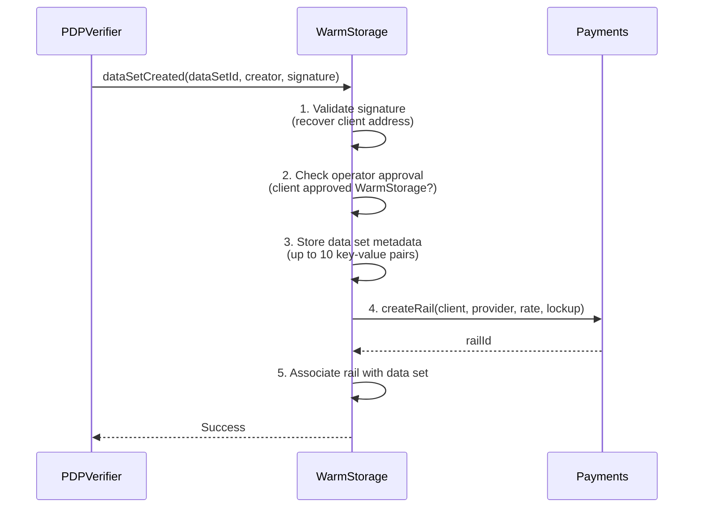
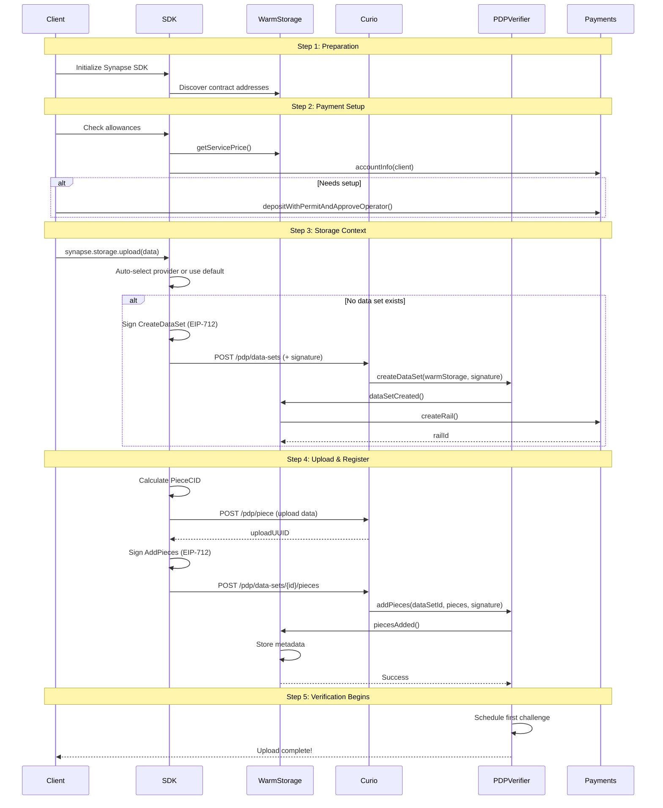

## What is Warm Storage?

**Filecoin Warm Storage Service (FWSS)** is the **business logic and coordination layer** that sits on top of the neutral PDP and Payments protocols to create a complete storage marketplace.

Warm Storage is the application layer in the [**three-layer architecture**](/core-concepts/architecture#architectural-principles), combining the neutral PDP protocol and generic FilecoinPay infrastructure into a complete storage service.

:::tip[Choose Your Path]
- **SDK Users**: Focus on the high-level concepts, then jump to [Synapse SDK guides](/synapse-sdk/)
- **Smart Contract Developers**: Study the PDPListener integration and EIP-712 authentication
- **Protocol Researchers**: Deep dive into the metadata system and fault handling patterns
:::

### Why "Warm Storage"?

**Warm Storage** refers to data that needs to be:

- ✅ **Accessible**: Available for retrieval within minutes
- ✅ **Verified**: Cryptographically proven to exist
- ✅ **Affordable**: Less expensive than "hot" (CDN) storage
- ✅ **Reliable**: Guaranteed to persist with payment backing

Compared to:

- **Hot Storage**: Instant access, CDN-backed, higher cost
- **Cold Storage**: Archived data, slower retrieval, lowest cost

### Core Responsibilities

WarmStorage manages the complete storage marketplace:

1. **Client Authentication**: Validates all client operations via EIP-712 signatures (see [Authentication Flow](#authentication-flow))
2. **Payment Coordination**: Automatically creates and manages [payment rails](/core-concepts/filecoin-pay-overview)
3. **Cost Calculation**: Determines pricing based on size, duration, and CDN usage (see [Pricing and Cost Calculation](#pricing-and-cost-calculation))
4. **Metadata Management**: Stores data set and piece metadata for discovery (see [Metadata System](#metadata-system))
5. **Fault Handling**: Integrates [PDP verification](/core-concepts/pdp-overview) results with payment adjustments

## PDPListener Integration

### Callback Pattern

WarmStorage implements `PDPListener` to receive events from PDPVerifier:

```solidity
interface PDPListener {
    function dataSetCreated(uint256 dataSetId, address creator, bytes calldata extraData);
    function piecesAdded(uint256 dataSetId, uint256 firstAdded, Cids.Cid[] memory pieceData, bytes calldata extraData);
    function possessionProven(uint256 dataSetId, uint256 challengedLeafCount, uint256 seed, uint256 challengeCount);
    function nextProvingPeriod(uint256 dataSetId, uint256 challengeEpoch, uint256 leafCount, bytes calldata extraData);
}
```

**Why callbacks?**:

- PDPVerifier stays neutral (no business logic)
- WarmStorage adds storage-specific behavior
- Separation of concerns
- Extensible design

### dataSetCreated

**Triggered**: When new data set created in PDPVerifier

**Purpose**: Set up payment infrastructure and validate client



**Key actions**:

1. **Signature validation**: Ensure client authorized this operation
2. **Operator check**: Verify client has approved WarmStorage
3. **Metadata storage**: Save data set metadata (category, project, etc.)
4. **Payment rail creation**: Establish automated payment channel
5. **Association**: Link rail ID to data set ID

### piecesAdded

**Triggered**: When pieces added to existing data set

**Purpose**: Store piece metadata and update payment rail if needed

```solidity
function piecesAdded(
    uint256 dataSetId,
    uint256 firstAdded,
    Cids.Cid[] memory pieceData,
    bytes calldata extraData  // Contains signature
) external override {
    // 1. Validate signature
    address signer = _validateSignature(extraData, ...);
    require(signer == dataSetOwner, "Unauthorized");

    // 2. Store piece metadata (up to 5 keys per piece)
    for (uint256 i = 0; i < pieceData.length; i++) {
        storePieceMetadata(dataSetId, pieceData[i], metadata[i]);
    }

    // 3. Update payment rail if storage requirements increased
    if (needsMorePayment) {
        payments.modifyRailPayment(railId, newRate, 0);
    }
}
```

**First piece special case**:

- If data set has no prior pieces, rail created here
- Payment rail creation deferred to first piece upload
- Enables data sets without immediate storage

### Proof Callbacks

WarmStorage implements two callbacks for proof handling:

#### possessionProven

**Triggered**: After successful proof verification

**Purpose**: Record successful proof completion

```solidity
function possessionProven(
    uint256 dataSetId,
    uint256 challengedLeafCount,
    uint256 seed,
    uint256 challengeCount
) external override {
    // Record successful proof
    // Update provider performance metrics
    // Emit event for monitoring
}
```

#### nextProvingPeriod

**Triggered**: When proof window expires without valid proof (fault)

**Purpose**: Handle proof failures and apply penalties

```solidity
function nextProvingPeriod(
    uint256 dataSetId,
    uint256 challengeEpoch,
    uint256 leafCount,
    bytes calldata extraData
) external override {
    // Fault detected
    // Future: Implement penalties via payment rail adjustments
    // Example: Reduce payment rate, apply one-time penalty
    // Emit event for monitoring
}
```

**Current implementation**: Logs faults, no penalties yet

**Future enhancements**:

- Reduce payment rate on repeated faults
- Apply fixed penalties from lockup pool
- Auto-terminate rail after threshold faults
- Provider reputation scoring

## IValidator Integration

Warm Storage implements the `IValidator` interface from FilecoinPay to mediate payments based on proof results.

- Reduce payments when proofs fail
- Apply penalties for repeated faults
- Terminate rails after fault thresholds
- Implement custom SLA enforcement
- Pay only for proven epochs

**Example validator function**:

```solidity
function validatePayment(
    uint256 railId,
    uint256 proposedAmount,
    uint256 fromEpoch,
    uint256 toEpoch,
    uint256 rate
) external returns (ValidationResult memory result) {
    // Check fault history for this rail
    // Adjust payment based on proof success rate
    // Return validated amount (could be less than proposed)
}
```

This integration allows the service layer to automatically enforce quality of service through payment adjustments.

:::note[Validator Status]
The IValidator integration is **planned for future implementation**. Currently, WarmStorage logs faults but does not apply payment penalties. Future versions will implement SLA enforcement through payment adjustments.
:::

## Security Boundaries

**Authentication Boundaries**:
- WarmStorage authenticates all client operations via EIP-712 signatures
- Never trusts off-chain requests without cryptographic signatures
- Client signatures must be validated before any state changes

**Contract Boundaries**:
- PDPVerifier owns proof verification logic; WarmStorage reacts to callbacks
- FilecoinPay owns token accounting; WarmStorage requests changes within allowances
- WarmStorage owns metadata and pricing; other contracts cannot modify directly

**Trust Model**:
- Clients trust approved operators (WarmStorage) to create fair payment rails
- Providers trust lockup mechanism for payment guarantees
- Both parties trust PDPVerifier for neutral proof verification
- All trust relationships are explicit and on-chain

## Metadata System

### Data Set Metadata

**Purpose**: Categorize and organize data sets

**Constraints**:

- Maximum 10 key-value pairs per data set
- Keys: max 32 characters
- Values: max 128 characters
- Stored on-chain (accessible to all)

**Common use cases**:

```typescript
{
  category: 'videos',           // Content type
  project: 'myapp',             // Application name
  environment: 'production',    // Stage
  owner: 'alice',               // Human-readable owner
  description: 'User uploads'   // Purpose
}
```

### Piece Metadata

**Purpose**: Track individual file information

**Constraints**:

- Maximum 5 key-value pairs per piece
- Same size limits as data set metadata
- Stored per piece within data set

**Common use cases**:

```typescript
{
  filename: 'video.mp4',        // Original filename
  size: '10485760',             // Size in bytes
  contentType: 'video/mp4',     // MIME type
  uploadedBy: 'user123',        // Uploader ID
  timestamp: '1234567890'       // Upload time
}
```

## Pricing and Cost Calculation

### Two-Tier Pricing

**Base Storage** (`pricePerEpochPerByte`):

- Standard storage with HTTP access
- Retrieval latency: seconds to minutes
- Lower cost, suitable for most use cases

**CDN Storage** (`cdnPricePerEpochPerByte`):

- Content Delivery Network backed
- Retrieval latency: milliseconds
- Higher cost, for performance-critical data

### Pricing Model Inputs

**Storage Cost Calculation**:
- **Size**: Total bytes across all pieces in data set
- **Duration**: Number of epochs to store (minimum 1 epoch)
- **CDN Usage**: Whether pieces require CDN access
- **Rate**: `size × epochs × (basePrice + cdnPrice)`

**Allowance Requirements**:
- **Rate Allowance**: Maximum tokens per epoch across all rails
- **Lockup Allowance**: Maximum total lockup amount
- **Lockup Period**: Maximum lockup duration per rail

:::note[Current Pricing]
Pricing is set by the WarmStorage contract and can be queried via `getServicePrice()`. Users must approve sufficient allowances before creating storage contexts.
:::


## Complete Upload Flow

:::note[System-Wide Flow]
This diagram shows the complete upload flow from the Warm Storage perspective. For how all components interact architecturally, see [**System Architecture - Data Flow Examples**](/core-concepts/architecture#data-flow-examples).
:::

### Step-by-Step Process



## Summary

**Filecoin Warm Storage Service**:

- Business logic layer combining PDP + Payments
- Orchestrates decentralized storage marketplace
- Manages authentication, providers, pricing, metadata
- Automatically creates and manages payment rails

**Key Components**:

- **Client Authentication**: EIP-712 signatures for all operations
- **Payment Coordination**: Automated rail creation and updates
- **Metadata System**: On-chain data set and piece organization
- **PDPListener Integration**: Responds to verification events

**Security**:

- EIP-712 signature validation
- Operator approval model with allowances
- Payment lockup guarantees
- Transparent on-chain operations

**Integration**:

- SDK handles all complexity automatically
- Address discovery via WarmStorage
- Simple upload/download API
- Comprehensive cost calculation
- Metadata for organization and discovery

## Next Steps

Now that you understand Warm Storage:

- [**Developer Guides**](/synapse-sdk/) - Build applications with the SDK
- [**Storage Guide**](/synapse-sdk/storage/) - Upload and download files
- [**Payments Guide**](/synapse-sdk/payments/) - Manage deposits and allowances
- [**Architecture**](/core-concepts/architecture) - Deep dive into system design
