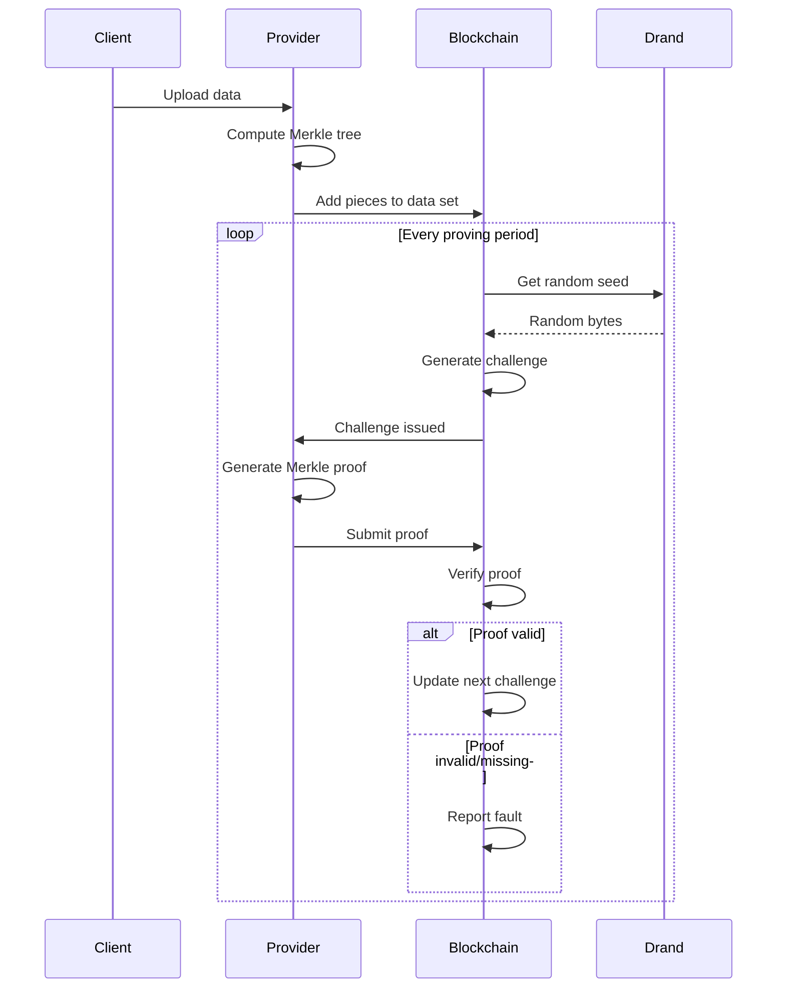
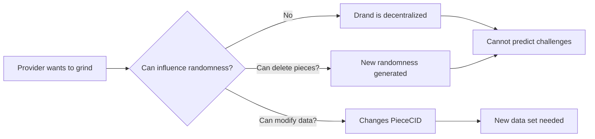

This guide explains **Proof of Data Possession (PDP)**, the cryptographic protocol which ensures every dataset stored within the **Filecoin Onchain Cloud (FOC)** remains accessible, verifiable, and provably intact without re-uploading the full data.

:::tip[Architecture Integration]
This page focuses on the PDP protocol details. To understand how PDP integrates with the overall system architecture, see [**System Architecture**](/core-concepts/architecture).
:::

## What is PDP?

**Proof of Data Possession (PDP)** is a cryptographic protocol that allows a client or smart contract to verify that a storage provider still holds a dataset, without downloading it again.

In simple terms — PDP asks a provider to prove they still have the data by responding correctly to a randomized challenge generated from that data.
If the provider no longer stores the content, they cannot produce a valid proof.

This mechanism provides the verifiable heartbeat of Filecoin Onchain Cloud — proving that storage agreements are being honored in real time.

:::note[PDP Constraints]
- **Piece sizes**: Must be multiples of 32 bytes (Filecoin requirement)
- **Maximum piece size**: 254 MiB per piece
- **PieceCID format**: Last 32 bytes of v2 CID used on-chain (not full CID)
- **Challenge timing**: Based on Filecoin epochs (~30 seconds each)
- **Proof window**: Typically 100-200 epochs (~50-100 minutes) to submit proofs
:::

## Why PDP Matters

Traditional cloud storage requires trust:

- You trust AWS/Google to store your data
- You can't verify they actually have it without downloading everything
- No cryptographic proof of possession

PDP is the key that allows Filecoin to evolve from *cold archival storage* to a **programmable cloud service layer** with fast data storage and retrival.
It introduces trustless verifiability for short-term and live data use cases, enabling new service types like **Filecoin Warm Storage, Filecoin Pin, and Onchain Data Hosting**, etc.

PDP provides three essential guarantees:

- **🧩 Integrity** — The data has not been altered or replaced. 
- **🌐 Availability** — The data is physically present and retrievable when challenged.
- **⚖️ Accountability** — Payments and service reputation are tied to verifiable proofs, not promises.

Every proof strengthens confidence that the Filecoin Onchain Cloud behaves like a reliable Web2-grade cloud, but with **onchain transparency and cryptographic verifiablity**.

### How PDP Works

At its core, PDP is a **challenge-response** protocol based on deterministic cryptography and verifiable computation. 

Each verification cycle follows these steps:


#### **Step-by-step Summary:**
1. **Data Upload**: The Client uploads file in a dataset to a PDP-enabled Service Provider which will  stores the file, and add piece in the dataset with the PDP contract onchain.

2. **Challenge Creation**: The PDP contract or dataset owner generates a randomized challenge based on a known seed and dataset ID.

3. **Proof Generation**: The Service Provider computes a proof using a subset of the stored data blocks (without revealing the actual data).

4. **Onchain Verification**: The PDP contract recomputes the challenge and checks that the proof corresponds to the expected Merkle root or commitment.

5. **Result & Settlement**: A successful verification emits an onchain event, which other contracts — such as Filecoin Pay — can use to release funds through the corresponding Payment Rail.

Each successful PDP round is a verifiable heartbeat proving that the dataset is still alive within the Onchain Cloud.

## Core Components

### PDPVerifier Contract

**Purpose**: The neutral protocol layer that manages verification

**Responsibilities**:

- Create and manage data sets on-chain
- Generate randomized challenges using Filecoin's drand beacon [singleton contract](https://github.com/filecoin-project/FIPs/blob/master/FIPS/fip-0095.md)
- Verify Merkle proofs submitted by providers
- Call listener contracts on events (creation, additions, faults)
- No business logic or payment handling

**Key Properties**:

- **Singleton design**: One contract manages all data sets
- **Provider-owned**: Only provider can modify their data sets
- **Randomness-based**: Uses Filecoin L1 drand beacon
- **Event-driven**: Listener pattern for extensibility

**Source**: `filecoin-services/service_contracts/lib/pdp/src/PDPVerifier.sol`

### Data Set

**What is it?**: A logical container of pieces managed by a storage provider for a client

```solidity
struct DataSet {
    uint64 id;
    uint64 challengeDelay;      // Epochs between proofs
    uint64 nextPieceID;         // Sequence number
    Piece[] pieces;             // Array of pieces
    uint256 totalSize;          // Total bytes
    uint256 nextChallengeEpoch; // When next challenge available
}
```

**Properties**:

- One data set per client-provider relationship
- Contains multiple pieces (files)
- Each piece has PieceCID + size
- Subject to periodic challenges
- Identified by unique `dataSetId`

### Piece and Merkle Trees

**Piece**: A unit of data stored in the system (typically one file)

```solidity
struct Piece {
    uint64 id;          // Unique within data set
    Cids.Cid data;      // PieceCID (32-byte digest)
    uint256 size;       // Must be multiple of 32 bytes
}
```

**PieceCID (CommP)**: Merkle root of the piece's data

- Calculated using binary Merkle tree
- Each leaf = 32 bytes of data
- Last 32 bytes of v2 CID = the digest used on-chain

**Logical Array**: All pieces concatenated into single array

- Pieces organized in order
- Fenwick/BIT tree for efficient binary search
- Enables challenge generation over all data

## Challenge-Response Cycle

### 1. Challenge Generation

**When**: Every `challengeDelay` epochs (e.g., every 30 minutes or 24 hours)

**How**:

1. Get next challenge epoch from data set
2. Fetch drand randomness from that epoch
3. Use randomness as seed for challenge
4. Generate random offset into logical array
5. Binary search to find which piece + leaf

**Randomness Source**: Filecoin's drand beacon

- Decentralized randomness beacon
- Cannot be predicted or manipulated
- Available via FEVM precompile
- Unique per epoch

**Example**:

```
Data set totalSize: 10MB = 327,680 leaves (32 bytes each)
Random seed from drand: 0x8f3a...
Challenge offset: seed % 327,680 = 145,234
→ Find piece containing leaf 145,234
→ Provider must prove that leaf
```

### 2. Proof Generation

**Provider's task**: Generate Merkle proof for challenged leaf

source code in curio [here](https://github.com/filecoin-project/curio/blob/main/tasks/pdp/task_prove.go)

**Merkle Proof Structure**:

A Merkle proof consists of the challenged leaf and sibling hashes along the path to the root.

<details>
<summary>Merkle Tree Implementation Reference</summary>

```solidity
// Builds a merkle tree from an array of leaves.
// The tree is an array of arrays of bytes32.
// The last array is the leaves, and each prior array is the result of the hash of pairs in the previous array.
// An unpaired element is paired with the root of a tree of the same height with zero leaves.
// The first element of the first array is the root.
function buildTree(bytes32[] memory leaves) internal view returns (bytes32[][] memory)

// Gets an inclusion proof from a Merkle tree for a leaf at a given index.
// The proof is constructed by traversing up the tree to the root, and the sibling of each node is appended to the proof.
// A final unpaired element in any level is paired with the zero-tree of the same height.
// Every proof thus has length equal to the height of the tree minus 1.
function buildProof(bytes32[][] memory tree, uint256 index) internal pure returns (bytes32[] memory)

struct Proof {
    bytes32 leaf;
    bytes32[] proof;
}
```

</details>

**Process**:

1. Load the piece containing challenged leaf
2. Read the specific 32-byte leaf
3. Compute Merkle path from leaf to root
4. Collect sibling hashes along the path
5. Submit proof to contract

**Proof Size**: ~log₂(piece_size/32) × 32 bytes

- 1 MB piece ≈ 32,768 leaves ≈ 15 siblings ≈ 480 bytes
- 128 MB piece ≈ 4,194,304 leaves ≈ 22 siblings ≈ 704 bytes

### 3. Proof Verification

**Contract verification**:

The contract verifies proofs by recomputing the Merkle root and comparing it to the stored PieceCID.

<details>
<summary>Contract Verification Reference</summary>

```solidity
function provePossession(
    uint256 setId,
    IPDPTypes.Proof[] calldata proofs
) external {
    // 1. Verify proof period is valid
    // 2. Find challenged pieces
    // 3. Verify Merkle proof
    // 4. Emit success event or revert
}
```

</details>

**Verification Steps**:

1. **Check timing**: Must be within challenge window
2. **Recompute root**: Hash leaf with siblings up the tree
3. **Compare to PieceCID**: Does computed root match stored CID?
4. **If match**: Proof valid ✅
5. **If mismatch**: Proof invalid ❌

**Merkle Verification Math**:

```
Start: leaf (32 bytes)
Step 1: hash(leaf, sibling[0])
Step 2: hash(result, sibling[1])
...
Final: root (should equal PieceCID)
```

**Key Points**:

- Provider must store the original piece data to regenerate proofs
- Can't predict which leaf will be challenged (randomness from drand)
- Proof size is O(log n) where n is number of leaves (~few KB for GB of data)
- Verification is fast and happens entirely on-chain

### 4. Fault Reporting

**What triggers a fault**:

- Proof not submitted within challenge window
- Invalid proof submitted challenge window closes
- Provider explicitly calls `nextProvingPeriod()` without proof

**Fault handling**:

```solidity
interface PDPListener {
    function possessionProven(
        uint256 dataSetId,
        uint256 challengedLeafCount,
        uint256 seed,
        uint256 challengeCount
    );

    function nextProvingPeriod(
        uint256 dataSetId,
        uint256 challengeEpoch,
        uint256 leafCount,
        bytes calldata extraData
    );
}
```

**In Warm Storage**:

- Fault event triggers penalty logic
- May adjust payment rails
- Provider reputation affected
- Client notified of fault

## Security Properties

### Soundness

**Property**: Provider cannot fake proof without actually having the data

**Why it works**:

- Merkle tree is cryptographically binding
- Cannot compute root without all leaves
- Cannot predict which leaf will be challenged (randomness)
- Grinding attacks prevented (see below)

**Attack resistance**:

- ❌ Cannot pre-compute proofs (unknown challenges)
- ❌ Cannot fake proofs (hash collision resistant)
- ❌ Cannot grind randomness (drand is unpredictable)

### Completeness

**Property**: Honest provider with data can always generate valid proof

**Why it works**:

- Merkle proof generation is deterministic
- All data available → can prove any leaf
- Contract verification is deterministic

### Unpredictability

**Property**: Provider cannot predict future challenges

**Randomness guarantees**:

- Drand beacon is decentralized (League of Entropy)
- Randomness revealed only at challenge epoch
- No single entity controls randomness
- Verifiable random function (VRF) based

**Grinding prevention**:



## Proving Periods and Challenge Windows

### Timing Parameters

**Challenge Delay**: Minimum epochs between successive challenges

- Set per data set
- Example: 2,880 epochs (1 day on Filecoin)

**Challenge Window**: Time allowed to submit proof

- Typically 100-200 epochs (~50-100 minutes)
- Provider must submit before window expires

**Next Challenge Epoch**: When next challenge becomes available

- `lastProvedEpoch + challengeDelay`
- Cannot prove early (prevents grinding)


## Data Set Operations

### Creating a Data Set

**Process**:

```solidity
function createDataSet(
    address listenerAddr,  // Listener contract (e.g., WarmStorage)
    bytes calldata extraData  // Client signature
) external returns (uint256 dataSetId)
```

**Who calls**: Storage provider (via Curio)

**What happens**:

1. Generate new data set ID
2. Initialize data set state
3. Set challenge delay
4. Call listener's `dataSetCreated()`
5. Return data set ID

**Listener callback** (called on the record keeper contract):

```solidity
function dataSetCreated(
    uint256 dataSetId,
    address creator,
    bytes calldata extraData
) external {
    // WarmStorage implementation:
    // 1. Verify client signature in extraData
    // 2. Create payment rail
    // 3. Store data set metadata
}
```

### Adding Pieces

**Process**:

```solidity
function addPieces(
    uint256 dataSetId,
    Cids.Cid[] calldata pieceCids,   // 32-byte digests
    uint256[] calldata sizes,         // Piece sizes
    bytes calldata extraData          // Client signature
) external
```

**Requirements**:

- Sizes must be multiples of 32 bytes
- Within size limits (127 bytes - 254 MiB)
- Only provider can add to their data set

**What happens**:

1. Validate pieces (size, format)
2. Assign piece IDs
3. Update logical array (Fenwick tree)
4. Update total size
5. Call listener's `piecesAdded()`

```solidity
function piecesAdded(
    uint256 dataSetId,
    uint256 firstAdded,
    Cids.Cid[] calldata pieceData,
    bytes calldata extraData
) external{
    // WarmStorage:
    // 1. Verify client signature in extraData
    // 2. Store pieces metadata
}
```

**Batching benefits**:

- Multiple pieces in one transaction
- Reduced gas costs
- SDK batches automatically (10 pieces/tx)

### Removing Pieces

**Process**:

```solidity
function removePieces(
    uint256 dataSetId,
    Cids.Cid[] calldata pieceCids
) external
```

**What happens**:

1. Find pieces by CID
2. Remove from logical array
3. Update total size
4. Renormalize Fenwick tree
5. Call listener's `piecesRemoved()`

```solidity
function piecesRemoved(
    uint256 dataSetId,
    uint256 firstRemoved,
    Cids.Cid[] calldata pieceData,
    bytes calldata extraData
) external{
    // WarmStorage:
    // 1. Verify client signature in extraData
}
```

**Use cases**:

- Delete expired data
- Remove specific files
- Data set cleanup


## Summary

**PDP (Proof of Data Possession)**:

- Cryptographic protocol for verifiable storage
- Proves provider has data without revealing it
- Uses Merkle trees and randomized challenges
- Integrated with smart contracts on Filecoin

**Key Components**:

- **PDPVerifier**: Core verification contract
- **Data Sets**: Containers of pieces
- **Challenges**: Random requests for proofs
- **Proofs**: Merkle paths proving possession

**Security**:

- Sound (cannot fake without data)
- Complete (honest provider always succeeds)
- Unpredictable (drand randomness)
- Audited by Zellic (April 2025)

**Integration**:

- Automatic in Synapse SDK
- Listener pattern for extensibility
- Payment rails tied to proof success
- Faults reported on failures

## Next Steps

Now that you understand PDP:

- [**Architecture**](/core-concepts/architecture) - How PDP integrates with the system
- [**Filecoin Pay**](/core-concepts/filecoin-pay-overview) - Payment rails and fault penalties
- [**Developer Guides**](/synapse-sdk/) - Build applications with PDP verification
