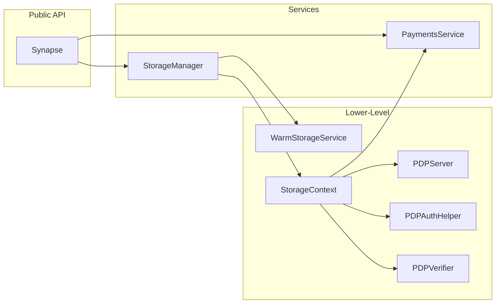
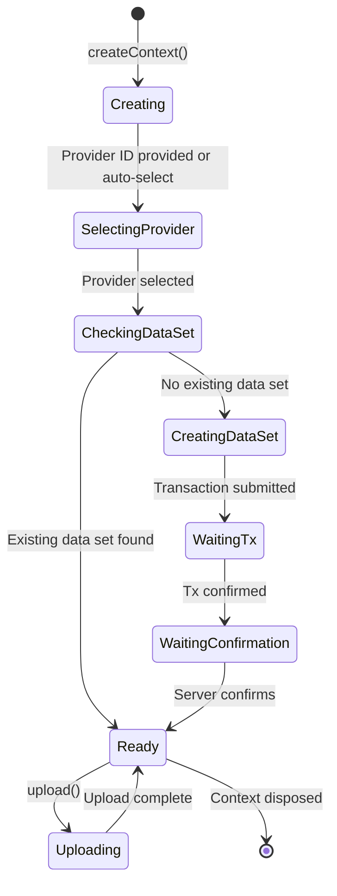
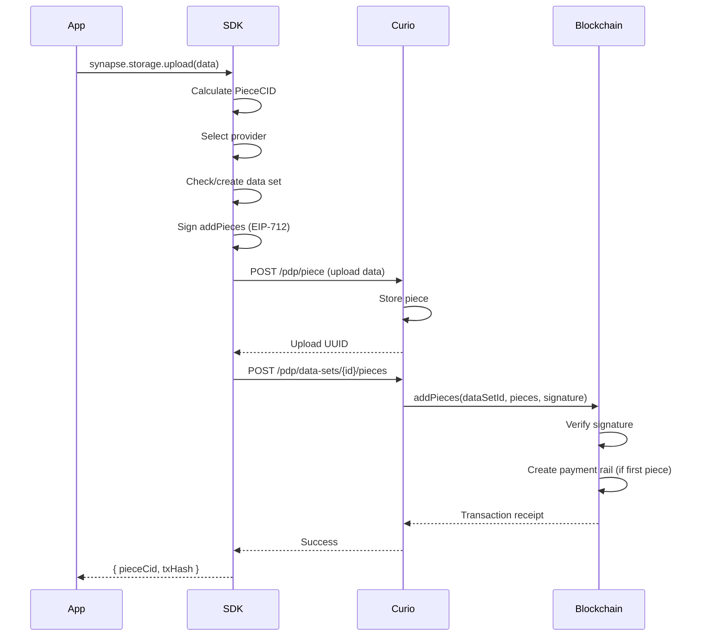
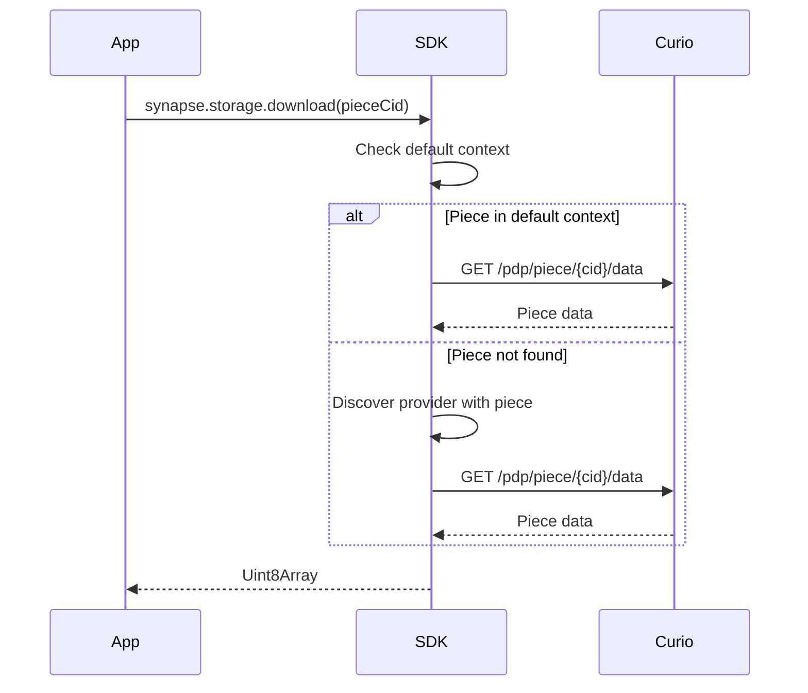
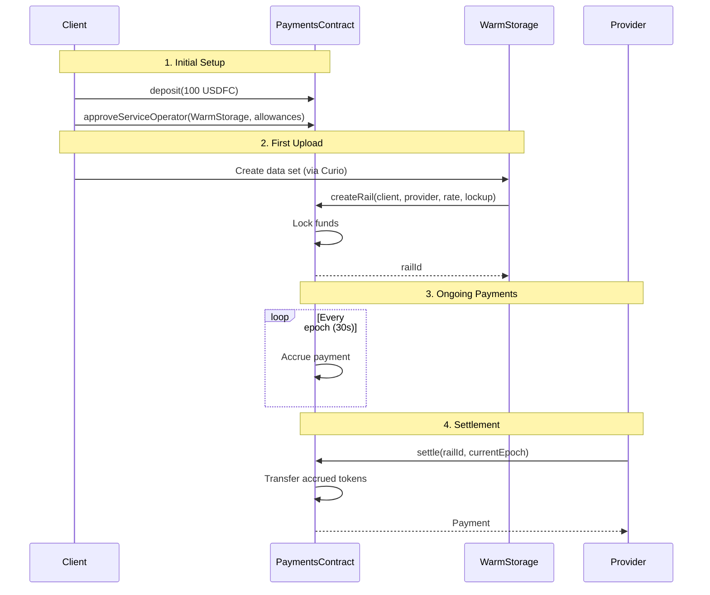

## What is Synapse SDK?

Synapse SDK is a TypeScript SDK for interacting with the Filecoin On-Chain Cloud system. It provides a high-level API for interacting with the system, as well as a low-level API for interacting with the underlying contracts.

:::tip[SDK Handles Everything]
**Most developers never directly interact with WarmStorage contracts.** The Synapse SDK abstracts all complexity. Read this guide to understand what's happening under the hood, but remember: `synapse.storage.upload()` handles all of this automatically.
:::

:::caution[SDK Components vs Smart Contracts]
This page describes **TypeScript SDK components** (classes you import and use in your code). These are **different from the smart contracts** they interact with:

**SDK Components** (this page):

- `Synapse` - Main entry point class
- `PaymentsService` - Client for FilecoinPay V1 contract
- `StorageManager`, `StorageContext` - Storage operation classes
- `WarmStorageService` - Client for WarmStorage contract
- `PDPServer` - HTTP client for Curio providers
- `PDPAuthHelper` - Signature generation utility

**Smart Contracts** ([Architecture page](/core-concepts/architecture)):

- PDPVerifier - Proof verification contract
- FilecoinPay V1 - Payment rails contract
- WarmStorage - Business logic contract

When this page says "PaymentsService", it means the **SDK class**. When you see "FilecoinPay contract", it means the **on-chain smart contract**.
:::

## Synapse Overview

**SDK Components**:

- **Synapse**: Main SDK entry point with simple, high-level API
- **PaymentsService**: SDK client for managing deposits, approvals, and payment rails (interacts with FilecoinPay V1 contract)
- **StorageManager**: High-level, auto-managed storage operations
- **StorageContext**: Provider-specific storage operations
- **WarmStorageService**: SDK client for storage coordination and pricing (interacts with WarmStorage contract)
- **PDPServer**: HTTP client for Curio provider APIs
- **PDPAuthHelper**: Generate EIP-712 signatures for authenticated operations



**Design Principles**:

- **Separation of Concerns**: Protocol, business logic, and application layers are distinct
- **Composability**: Each component can be used independently or together
- **Abstraction**: SDK hides blockchain complexity from applications
- **Verification**: All storage backed by cryptographic proofs

### Component Responsibilities

**Purpose**: Minimal, high-level API with auto-discovery

**Source**: `src/synapse.ts`

**Responsibilities**:

- Factory pattern initialization (`Synapse.create()`)
- Network detection from provider chainId
- Contract address discovery
- Component orchestration

**Key Methods**:

```typescript
class Synapse {
  static async create(options: SynapseOptions): Promise<Synapse>;

  // Properties
  payments: PaymentsService;
  storage: StorageManager;

  // Helpers
  getWarmStorageAddress(): string;
  getProvider(): ethers.Provider;
  getSigner(): ethers.Signer;
}
```

**Address Discovery Flow**:

1. Get WarmStorage address (network-specific constant)
2. Query WarmStorage for Payments address
3. Query WarmStorage for PDPVerifier address
4. All other contracts discovered via Multicall3

#### PaymentsService (SDK Component)

**Purpose**: SDK client for managing deposits, approvals, and payment rails

**Interacts With**: FilecoinPay V1 smart contract (see [FilecoinPay Technical Overview](/core-concepts/filecoin-pay-overview))

**Source**: `src/payments/service.ts`

**Key Features**:

- USDFC token deposits/withdrawals
- Service operator approvals
- Payment rail queries
- EIP-2612 permit support
- Account health monitoring

**API Design**:

```typescript
class PaymentsService {
  // Deposits
  deposit(amount: bigint): Promise<TransactionResponse>
  depositWithPermit(amount: bigint, deadline: bigint, v: number, r: string, s: string)
  depositWithPermitAndApproveOperator(...)

  // Balances
  balance(): Promise<bigint>
  walletBalance(token: string): Promise<bigint>
  accountInfo(): Promise<AccountInfo>

  // Operator management
  approveService(service: string, rateAllowance: bigint, ...)
  revokeService(service: string)
  serviceApproval(service: string): Promise<ServiceApproval>

  // Rails
  getRailsAsPayer(): Promise<RailInfo[]>
  getRailsAsPayee(): Promise<RailInfo[]>
  settle(railId: bigint, targetEpoch: bigint)
}
```

**Nonce Management**:

- Uses ethers `NonceManager` by default
- Handles concurrent transactions automatically
- Can be disabled with `disableNonceManager: true`

#### StorageManager (SDK Component)

**Purpose**: High-level, auto-managed storage operations

**Source**: `src/storage/manager.ts`

**Features**:

- Auto provider selection
- Context caching
- SP-agnostic downloads (with optimization)
- Simple upload/download API

**Workflow**:

```typescript
class StorageManager {
  // Simple operations
  async upload(data: Uint8Array, options?: UploadOptions);
  async download(pieceCid: string | PieceCID): Promise<Uint8Array>;

  // Context management
  async createContext(options: StorageServiceOptions): Promise<StorageContext>;

  // Info
  async getStorageInfo(): Promise<StorageInfo>;
}
```

**Download Optimization**:

- Checks default context first (fast path)
- Falls back to provider discovery if needed
- Reduces latency for repeated downloads

#### StorageContext (SDK Component)

**Purpose**: Provider-specific storage operations

**Source**: `src/storage/context.ts`

**Represents**: Connection to one storage provider + one data set

**Lifecycle**:



**Key Methods**:

```typescript
class StorageContext {
  // Uploads
  async upload(data: Uint8Array, options?: UploadOptions);

  // Downloads
  async download(pieceCid: string | PieceCID): Promise<Uint8Array>;

  // Queries
  async hasPiece(pieceCid: string | PieceCID): Promise<boolean>;
  async pieceStatus(pieceCid: string | PieceCID);
  async getDataSetPieces(): Promise<PieceData[]>;

  // Info
  async getProviderInfo(): Promise<ProviderInfo>;
}
```

#### WarmStorageService (SDK Component)

**Purpose**: SDK client for storage coordination and pricing

**Interacts With**: FilecoinWarmStorageService smart contract (see [Warm Storage Overview](/core-concepts/fwss-overview))

**Source**: `src/warm-storage/service.ts`

**Responsibilities**:

- Fetch storage pricing (CDN vs non-CDN)
- Query data set metadata
- Provide contract addresses
- Cost calculations

**Factory Pattern**:

```typescript
class WarmStorageService {
  static async create(
    provider: ethers.Provider,
    warmStorageAddress: string
  ): Promise<WarmStorageService>;

  // Pricing
  async getServicePrice(): Promise<PriceInfo>;

  // Addresses
  getPaymentsAddress(): string;
  getPDPVerifierAddress(): string;
  getUSDFCAddress(): string;

  // Data sets
  async getDataSetMetadata(dataSetId: bigint): Promise<Record<string, string>>;
}
```

**Address Discovery**:

- Queries WarmStorage contract via Multicall3
- Caches addresses for performance
- Single batch call for all addresses

#### PDPServer (SDK Component)

**Purpose**: HTTP client for Curio provider APIs

**Note**: This is **not** a client for the PDPVerifier smart contract. It communicates with Curio storage providers via HTTP.

**Source**: `src/pdp/server.ts`

**Curio API Endpoints**:

- `POST /pdp/data-sets` - Create data set
- `GET /pdp/data-sets/created/{txHash}` - Poll creation status
- `POST /pdp/data-sets/{id}/pieces` - Add pieces
- `POST /pdp/piece` - Start upload session
- `PUT /pdp/piece/upload/{uuid}` - Upload piece data
- `GET /pdp/piece` - Find existing pieces

**Key Methods**:

```typescript
class PDPServer {
  // Data sets
  async createDataSet(request: CreateDataSetRequest): Promise<string>;
  async waitForDataSetCreation(txHash: string): Promise<DataSetCreationStatus>;

  // Pieces
  async addPieces(dataSetId: bigint, request: AddPiecesRequest);
  async uploadPiece(data: Uint8Array): Promise<UploadResult>;
  async findPiece(pieceCid: PieceCID): Promise<PieceInfo | null>;

  // Downloads
  async downloadPiece(pieceCid: PieceCID): Promise<Uint8Array>;
}
```

**Polling Strategy**:

- Waits for transaction confirmation on-chain
- Polls Curio server for readiness (max 60s)
- Exponential backoff on errors

#### PDPAuthHelper (SDK Component)

**Purpose**: Generate EIP-712 signatures for authenticated operations

**Source**: `src/pdp/auth.ts`

**EIP-712 Domain**:

```typescript
{
  name: 'FilecoinWarmStorageService',
  version: '1',
  chainId: 314159,  // or 314 for mainnet
  verifyingContract: warmStorageAddress
}
```

**Signed Operations**:

- `CreateDataSet` - Initialize new data set
- `AddPieces` - Add pieces to data set
- `ScheduleRemovals` - Mark pieces for deletion
- `DeleteDataSet` - Remove data set

**Signature Flow**:

```typescript
class PDPAuthHelper {
  async signCreateDataSet(params: {
    metadata: MetadataEntry[];
  }): Promise<string>;

  async signAddPieces(params: {
    dataSetId: bigint;
    pieces: PieceData[];
    metadata: MetadataEntry[][];
  }): Promise<string>;
}
```

**Security**:

- Client signs for WarmStorage (not PDPVerifier)
- Signature included in Curio API calls
- Curio passes signature to blockchain as `extraData`
- WarmStorage validates signature in callback

### SDK Data Flow

**Upload Flow**:



**Download Flow**:



### Payment Flow Integration



## Next Steps

Now that you understand the architecture:

- [**PDP Overview**](/core-concepts/pdp-overview) - Deep dive into proof verification
- [**Filecoin Pay**](/core-concepts/filecoin-pay-overview) - Payment rails and lockup mechanism
- [**Developer Guides**](/synapse-sdk/) - Build with the SDK

## Summary

**Three Layers**:

1. **Application**: Your apps using the SDK
2. **SDK**: TypeScript abstraction (synapse-sdk)
3. **Contracts**: Smart contracts on Filecoin EVM

**Key Components**:

- **Synapse**: Main entry point
- **PaymentsService**: Deposits and rails
- **StorageManager/Context**: Upload/download
- **PDPVerifier**: Proof verification
- **Payments**: Payment infrastructure
- **WarmStorage**: Business logic

**Design Principles**:

- Separation of concerns
- Composable components
- Clean abstractions
- Cryptographic guarantees
